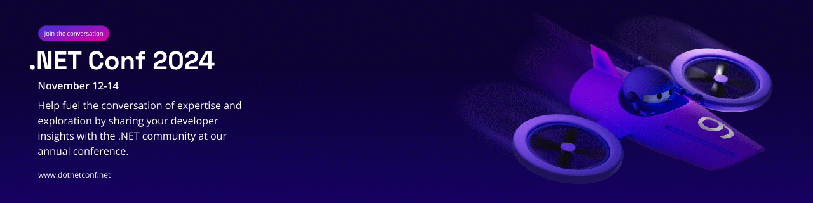

# .NET Conf 2024

* https://github.com/dotnetConf/2024
* https://github.com/dotnetConf/FocusOnAI_24

## Agenda

https://devblogs.microsoft.com/dotnet/dotnet-conf-2024-celebrating-the-release-of-dotnet-9-save-the-date/

## .NET 9

* https://devblogs.microsoft.com/dotnet/dotnet-9-rc-2/
* https://devblogs.microsoft.com/dotnet/dotnet-9-release-candidate-1-is-now-available/
* https://devblogs.microsoft.com/dotnet/performance-improvements-in-net-9/
* https://devblogs.microsoft.com/dotnet/binaryformatter-removed-from-dotnet-9/
* https://devblogs.microsoft.com/dotnet/system-text-json-in-dotnet-9/

## C# 13

* https://learn.microsoft.com/en-us/dotnet/csharp/whats-new/csharp-13

## ASP.NET Core

* https://learn.microsoft.com/en-us/aspnet/core/release-notes/aspnetcore-9.0?view=aspnetcore-9.0

## EF 

* https://learn.microsoft.com/en-us/ef/core/what-is-new/ef-core-9.0

## MAUI

* https://learn.microsoft.com/en-us/dotnet/maui/whats-new/dotnet-9?view=net-maui-8.0

## AI

* https://devblogs.microsoft.com/dotnet/introducing-microsoft-extensions-ai-preview/
* https://devblogs.microsoft.com/dotnet/announcing-the-stable-release-of-the-official-open-ai-library-for-dotnet/

